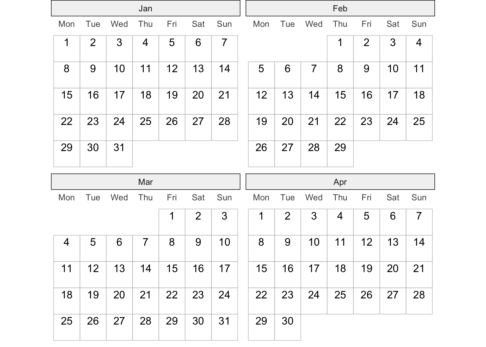
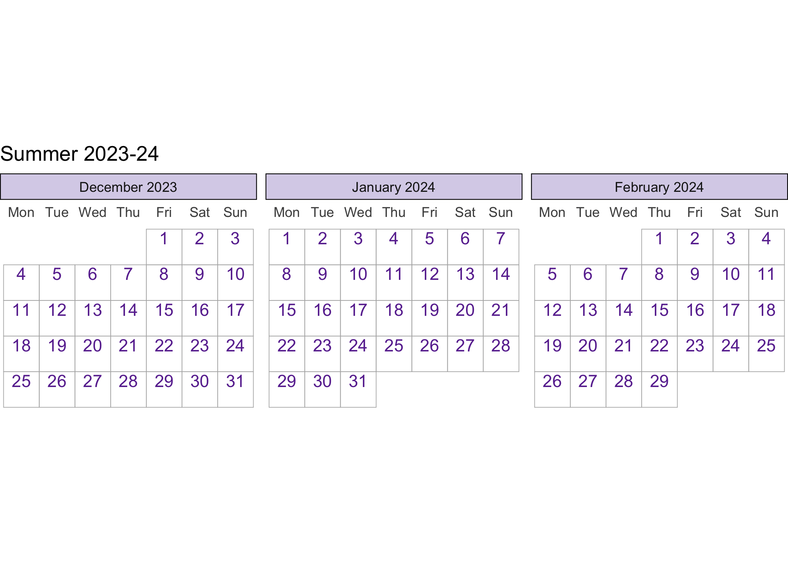
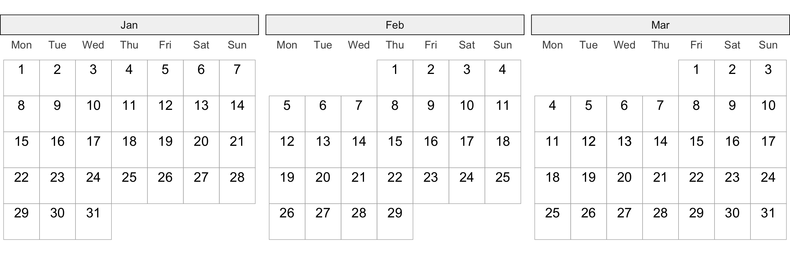
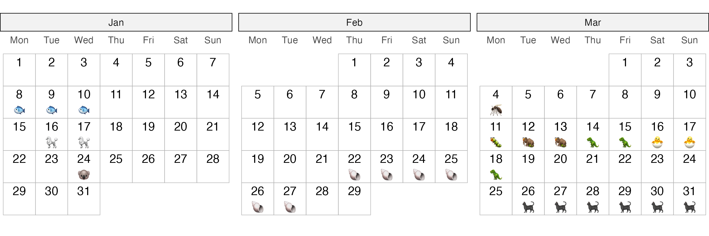

<!-- README.md is generated from README.Rmd. Please edit that file -->

# ggtilecal

<!-- badges: start -->

[](https://CRAN.R-project.org/package=ggtilecal)
<!-- badges: end -->

The goal of `ggtilecal` is to easily produce calendar layouts using
ggplot2 tile and text geoms, while retaining some customisation.

## Installation

You can install the development version of ggtilecal like so:

``` r
# install.packages("remotes")
remotes::install_github("cynthiahqy/ggtilecal")
```

## Examples

### Empty Calendar

``` r
library(ggtilecal)
make_empty_month_days(c("2024-01-05", "2024-04-04")) |>
  gg_facet_wrap_months(unit_date)
```



### Customising empty calendars

Layers in `.geom` inherit the internally generated calendar layout
mapping variables. `gg_facet_wrap_months()` provides users lists of
sensible default layers that can be easily modified. Customise the look
of each calendar tile using `geom_tile()`, and the text number labels
using `geom_text()`. Use a ggplot facet strip labeller to customise the
formatting of the calendar headers.

``` r
library(ggplot2)
make_empty_month_days(c("2023-12-01", "2024-02-28")) |>
  gg_facet_wrap_months(unit_date,
                       labeller = label_yearmonth("%B %Y"), 
                       .geom = list(
                         geom_tile(color = "grey70",
                                   fill = "transparent"),
                         geom_text(nudge_y = 0.25,
                                   color = "#6a329f")),
                       .theme = list(
                         theme_bw_tilecal(),
                         theme(strip.background = element_rect(fill = "#d9d2e9")))
                       ) + 
  labs(title="Summer 2023-24")
```



### Adding more layers to the calendar: Event emojis!

Prepare event details:

``` r
demo_events_overlap
#> # A tibble: 10 × 7
#> # Rowwise: 
#>    event_id title    start      end        duration emoji details               
#>       <int> <chr>    <date>     <date>        <int> <chr> <chr>                 
#>  1        1 Event 1  2024-01-08 2024-01-10        3 🐟    Adipiscing mauris et …
#>  2        2 Event 2  2024-01-16 2024-01-17        2 🐩    Sit aliquam feugiat p…
#>  3        3 Event 3  2024-01-24 2024-01-24        1 🐨    Lorem placerat sagitt…
#>  4        4 Event 4  2024-02-22 2024-02-27        6 🐚    Ipsum mollis fermentu…
#>  5        5 Event 5  2024-03-04 2024-03-04        1 🦟    Consectetur malesuada…
#>  6        6 Event 6  2024-03-11 2024-03-16        6 🐛    Sit bibendum porta ut…
#>  7        7 Event 7  2024-03-12 2024-03-17        6 🦣    Lorem cursus sem cubi…
#>  8        8 Event 8  2024-03-14 2024-03-18        5 🦖    Adipiscing fames magn…
#>  9        9 Event 9  2024-03-16 2024-03-17        2 🐣    Amet ligula sociis ve…
#> 10       10 Event 10 2024-03-26 2024-03-31        6 🐈‍⬛    Sit ridiculus id maec…
```

Reshape event data into “long” form, which in this context refers to
having one row per day of an event. In this example, if multiple events
(i.e. 6,7,8,9) expand to the same days, we select only one event to plot
an emoji for.

``` r
events_long <- demo_events_overlap |>
  reframe_events(start, end) |>
  dplyr::slice_min(order_by = duration, n = 1, by = unit_date)
events_long
#> # A tibble: 29 × 6
#>    event_id title   duration emoji details                            unit_date 
#>       <int> <chr>      <int> <chr> <chr>                              <date>    
#>  1        1 Event 1        3 🐟    Adipiscing mauris et augue dapibu… 2024-01-08
#>  2        1 Event 1        3 🐟    Adipiscing mauris et augue dapibu… 2024-01-09
#>  3        1 Event 1        3 🐟    Adipiscing mauris et augue dapibu… 2024-01-10
#>  4        2 Event 2        2 🐩    Sit aliquam feugiat primis duis s… 2024-01-16
#>  5        2 Event 2        2 🐩    Sit aliquam feugiat primis duis s… 2024-01-17
#>  6        3 Event 3        1 🐨    Lorem placerat sagittis vehicula … 2024-01-24
#>  7        4 Event 4        6 🐚    Ipsum mollis fermentum in risus r… 2024-02-22
#>  8        4 Event 4        6 🐚    Ipsum mollis fermentum in risus r… 2024-02-23
#>  9        4 Event 4        6 🐚    Ipsum mollis fermentum in risus r… 2024-02-24
#> 10        4 Event 4        6 🐚    Ipsum mollis fermentum in risus r… 2024-02-25
#> # ℹ 19 more rows
```

We can create an empty calendar that spans the months of the events:

``` r
events_long |>
  gg_facet_wrap_months(unit_date)
```



But maybe we want to indicate which days are event days:

``` r
emoji_cal <- events_long |>
  gg_facet_wrap_months(unit_date) +
  geom_text(aes(label = emoji), nudge_y = -0.25, na.rm = TRUE)
emoji_cal
```



Additional rows are introduced within `gg_facet_wrap_months()` to plot
the non-event days. Specify `na.rm = TRUE` on subsequent layers to
silence the warning. This silently removes both the missing values
generated when calculating calendar variables AS WELL AS any “true”
missing values originating in `events_long`.

If the emojis are not rendering, try changing your graphics device. For
knitr output this can be controlled using the `dev` chunk option. For
previews in RStudio, change Settings \> General \> Graphics (e.g. to
[AGG](https://ragg.r-lib.org/)). To save use something like
`ggplot2::ggsave("ggtilecal.png", emoji_cal, height=3, width=9, dpi=300)`

## Add interactive elements

We can also add interactive tile layers using
[`ggigraph`](https://davidgohel.github.io/ggiraph/):

``` r
library(ggiraph)
library(ggplot2)

gi <- events_long |>
  gg_facet_wrap_months(unit_date) +
  geom_text(aes(label = emoji), nudge_y = -0.25, na.rm = TRUE) +
  geom_tile_interactive(
        aes(
            tooltip = paste(title),
            data_id = event_id
        ),
        alpha = 0.2,
        fill = "transparent",
        colour = "grey80"
    )

if(interactive()){
  ggiraph::girafe(ggobj = gi)
}
```


## Related packages & inspiration

- <https://github.com/nrennie/tidytuesday/tree/main/2023/2023-03-07>
- [ggTimeSeries](https://github.com/AtherEnergy/ggTimeSeries)
- [ggweekly](https://github.com/gadenbuie/ggweekly)
- [ggcal](https://github.com/jayjacobs/ggcal/blob/master/R/ggcal.R)
- [davidmasp/calendar-ggplot](https://github.com/davidmasp/calendar-ggplot/blob/main/calendar.R)
